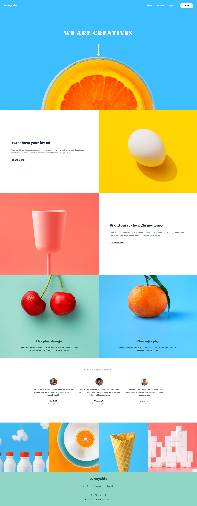
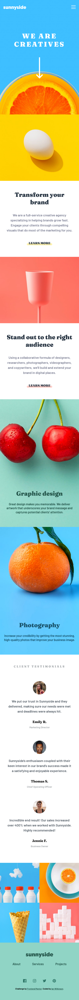

# Frontend Mentor - Sunnyside agency landing page solution

This is a solution to the [Sunnyside agency landing page challenge on Frontend Mentor](https://www.frontendmentor.io/challenges/sunnyside-agency-landing-page-7yVs3B6ef). Frontend Mentor challenges help you improve your coding skills by building realistic projects.

## Table of contents

- [Overview](#overview)
  - [The challenge](#the-challenge)
  - [Screenshot](#screenshot)
  - [Links](#links)
- [My process](#my-process)
  - [Built with](#built-with)
  - [What I learned](#what-i-learned)
  - [Continued development](#continued-development)
  - [Useful resources](#useful-resources)
- [Author](#author)

## Overview

### The challenge

Users should be able to:

- View the optimal layout for the site depending on their device's screen size
- See hover states for all interactive elements on the page

### Screenshot

Desktop:


Mobile: 



### Links

- [Live Site URL](https://sunnyside-landing-ianwilk20.netlify.app/design/)

## My process

### Built with

- Semantic HTML5 markup
- CSS custom properties
- Flexbox
- Mobile-first workflow

### What I learned

- The highlighted/underlined "Learn more" links were trickier than I thought. I learned how to use ```::after```  pseudo-element to acheive the effect. Specifically, I learned that the ```::before``` ```::after``` psuedo elements allow you to put content before or after an element postionally. In my case, the text content of the ```::after``` was empty, but had a height and a color for the highlighted appearance of the link. However, I also learned that if you specify text content for either of those pseudo elements, it allows you to insert content on a page without it needing to be in the HTML.

- Specific positioning for certain elements was required, for example, the header "We are creatives" with the arrow pointing down because they are overlayed on top of the orange cross-section. For this case, I needed to position the header and arrow relative to the ancestor that was the section holding the orange image. I then specified the ```top``` property to position the header and arrow 20% below the top of the ancestor.

### Continued development

I believe that I still need to work on the various kinds of positioning of elements and how they compare/when to use each. This challenge allowed me to dip my feet into using absolute and relative positioning, but I still am not entirely confident with those concepts yet.

After reviewing my CSS for this challenge, I feel like I wrote too much. Almost 800 lines of CSS seems quite excessive for a seemingly simple looking site. I noticed that when I had finished designing the mobile screen sizes, I did a lot of pixel perfect changes for the desktop screen. That's probably not ideal.

### Useful resources

- [Responsive navigation bar tutorial](https://www.youtube.com/watch?v=8eFeIFKAKHw) - I used this tutorial in my previous challenge that required a mobile navigation bar. I reused most of the same code as last time but made style modifications as per the mockups.
- [CSS creating a triangle with borders](https://css-tricks.com/snippets/css/css-triangle/) - This article taught me how to design the right-angle triangle that appears on the mobile navigation bar.


## Author

- GitHub - [ianwilk20](https://github.com/ianwilk20)
